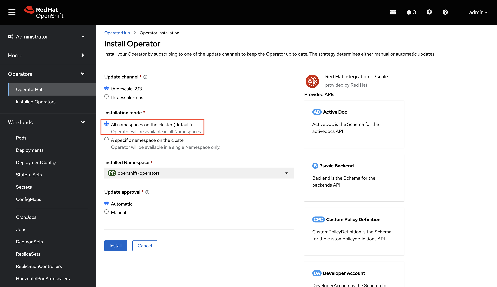
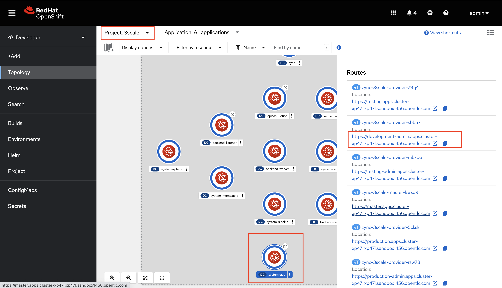
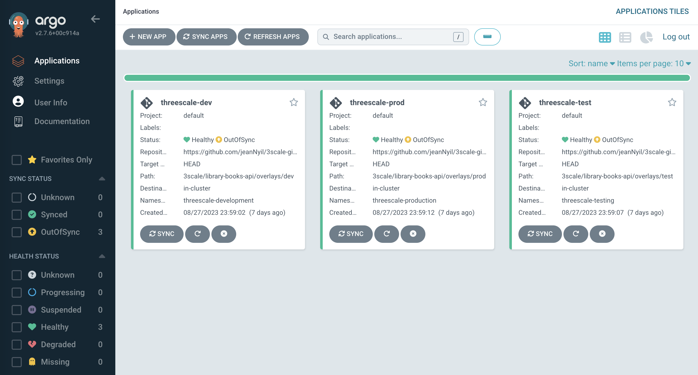
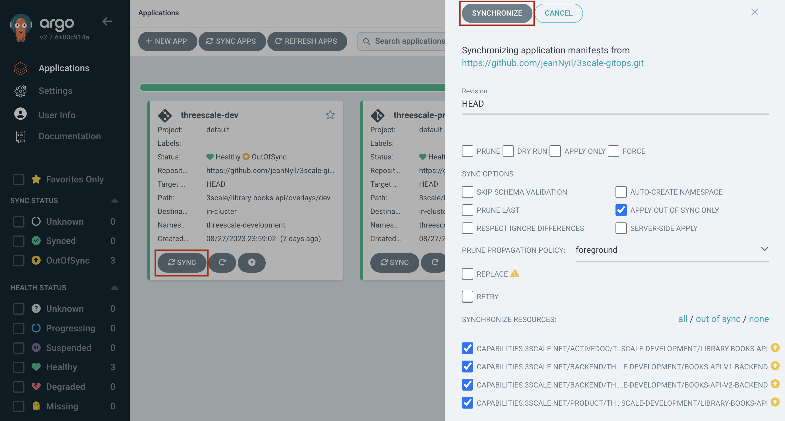
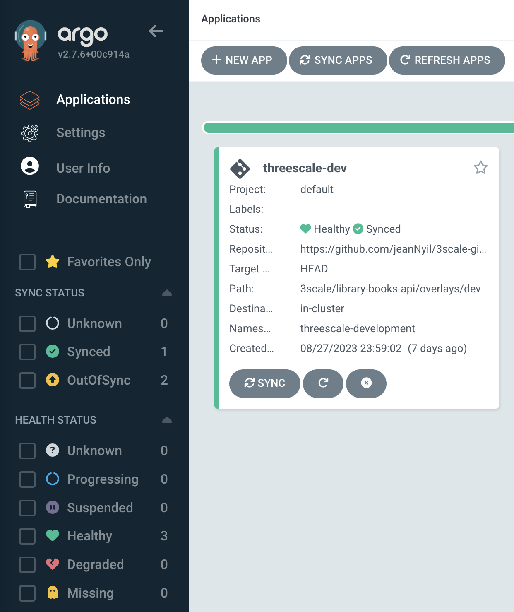
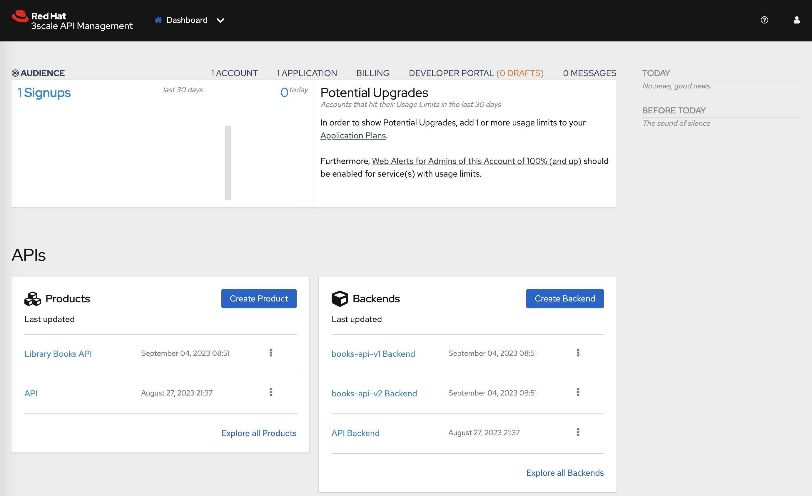
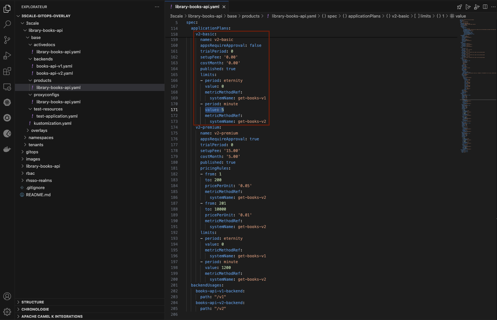
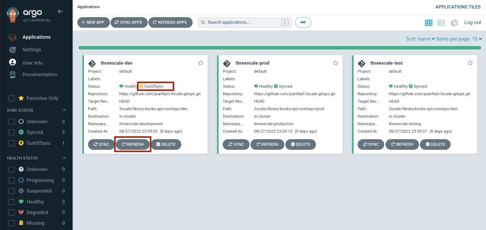
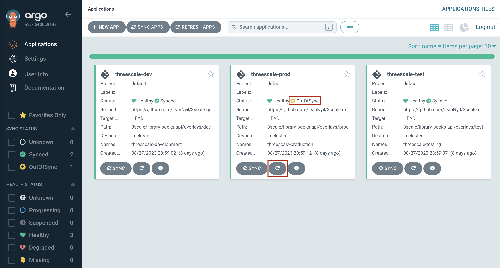

# 3scale Configuration - GitOps Tutorial

The following tutorial provide steps on leveraging GitOps to configure 3scale using 
3scale CRs (Product, Backend CRs etc.)

Instructions are inspired from the [https://github.com/jbossdemocentral/3scale-gitops](https://github.com/jbossdemocentral/3scale-gitops) repository. Additionally, the GitOps approach is implemented using [Red Hat OpenShift GitOps](https://docs.openshift.com/gitops/1.10/understanding_openshift_gitops/about-redhat-openshift-gitops.html) with [kustomize](https://kustomize.io/).

## Prerequisites
- [Red Hat OpenShift v4.10+](https://access.redhat.com/products/openshift/)
- Install 3scale operator from OperatorHub in all namespaces. We do this to set up the different tenants in different namespaces instead of them being in the same namespace as the master installation. 

- Follow the 3scale installation section in this guide to install 3scale using APIManager CR (https://rpscodes.github.io/OpenShift-Service-Mesh-and-3scale-API-Management-Integration/rhs-openshift-starter-guides/4/02-3scale-installation.html?&CLUSTER_WILDCARD_URL=)

## Install Red Hat OpenShift GitOps
Install Red Hat OpenShift GitOps operator from the OperatorHub in the OCP webconsole


This will automatically create 
- `openshift-gitops` namespace 
- `ArgoCD` CR with the name `openshift-gitops` in openshift-gitops namespace.
 `ArgoCD` CR creates a bunch of deployments. These deployments together make ArgoCD application
- `AppProject` CR with the name `default` in openshift-gitops namespace.

## Login to Red Hat OpenShift GitOps
Navigate to the `openshift-gitops` namespace and click on the route URL of  `openshift-gitops-server`


You can login to `OpenShift GitOps` using the `admin` user that comes with ArgoCD deployment
 

Find the password for the admin in `openshift-gitops-cluster` secret in `openshift-gitops` namespace.


## Create password secret for tenant creation
Create a secret which holds the password that will be used to login to the tenants. The 3scale operator will use this secret to set up the login credentials of the tenants.
```
oc project 3scale-amp
```
```
oc apply -f 3scale/tenants/tenant-admin-secret.yaml
```

## Create Tenants in different projects
We will be creating 3 different tenants (development, testing and production) in 3 different projects.

### Development Tenant
Create the `threescale-development` project on your OCP cluster
```
oc apply -f 3scale/namespaces/development-namespace.yaml
```
Edit the tenant CR to replace the placeholder openshift domain url with that of your cluster
```
sed 's/apps.*eu/<Replace with your OpenShift cluster application domain URI>/g' 3scale/tenants/tenant-development.yaml > temp.yml && mv temp.yml 3scale/tenants/tenant-development.yaml
```
Example
```
sed 's/apps.*eu/apps.cluster-8bcs7.8bcs7.sandbox2056.opentlc.com/g' 3scale/tenants/tenant-development.yaml > temp.yml && mv temp.yml 3scale/tenants/tenant-development.yaml
```
Create the `development` tenant
```
oc apply -f 3scale/tenants/tenant-development.yaml
```

### Testing Tenant
Create the `threescale-testing` project on your OCP cluster
```
oc apply -f 3scale/namespaces/testing-namespace.yaml
```
Edit the tenant CR to replace the placeholder openshift domain url with that of your cluster
```
sed 's/apps.*eu/<Replace with your OpenShift cluster application domain URI>/g' 3scale/tenants/tenant-testing.yaml > temp.yml && mv temp.yml 3scale/tenants/tenant-testing.yaml
```
Example
```
sed 's/apps.*eu/apps.cluster-8bcs7.8bcs7.sandbox2056.opentlc.com/g' 3scale/tenants/tenant-testing.yaml > temp.yml && mv temp.yml 3scale/tenants/tenant-testing.yaml
```
Create the `testing` tenant
```
oc apply -f 3scale/tenants/tenant-testing.yaml
```

### Production Tenant
Create the `threescale-production` project on your OCP cluster
```
oc apply -f 3scale/namespaces/production-namespace.yaml
```
Edit the tenant CR to replace the placeholder openshift domain url with that of your cluster
```
sed 's/apps.*eu/<Replace with your OpenShift cluster application domain URI>/g' 3scale/tenants/tenant-production.yaml > temp.yml && mv temp.yml 3scale/tenants/tenant-production.yaml
```
Example
```
sed 's/apps.*eu/apps.cluster-8bcs7.8bcs7.sandbox2056.opentlc.com/g' 3scale/tenants/tenant-production.yaml > temp.yml && mv temp.yml 3scale/tenants/tenant-production.yaml
```
Create the `production` tenant
```
oc apply -f 3scale/tenants/tenant-production.yaml
```

## Enabling RBAC
Create cluster role to create, update, delete 3scale CRs 

> **NOTE:** OpenShift cluster-admin privilege is required.

```
oc apply -f rbac/gitops-threescale-access_clusterrole.yaml
```
Assign the cluster role to the  `openshift-gitops-argocd-application-controller` service account in all of the projects where the 3scale tenants are deployed so that the ArgoCD Application can apply the desired configurations:

```
oc adm policy add-role-to-user gitops-threescale-access system:serviceaccount:openshift-gitops:openshift-gitops-argocd-application-controller -n threescale-development
```
```
oc adm policy add-role-to-user gitops-threescale-access system:serviceaccount:openshift-gitops:openshift-gitops-argocd-application-controller -n threescale-testing
```
```
oc adm policy add-role-to-user gitops-threescale-access system:serviceaccount:openshift-gitops:openshift-gitops-argocd-application-controller -n threescale-production
```

## Connect the git repository

Configure the repositories to be connected by the ArgoCD application 

1. Click `Manage your repositories, projects, settings` icon on the left panel of the ArgoCD console
2. Click 
`Repositories`
3. Click either `Connect repo using SSH` OR `Connect repo using HTTPS` and fill in the form as shown below and click `CONNECT`. Make sure it is SUCCESSFUL.


## Create ArgoCD Application
 
Create the ArgoCD Application for all the three environments/tenants. 

```
oc apply -f gitops/application_threescale-dev.yaml -n openshift-gitops
```
```
oc apply -f gitops/application_threescale-test.yaml -n openshift-gitops
```
```
oc apply -f gitops/application_threescale-prod.yaml -n openshift-gitops
```
Three ArgoCD applications (`threescale-dev` , `threescale-test` and `threescale-prod`) are created.

## Deploy the _Library Books API_ backend services

1. Create the `library-apis-dev`, `library-apis-test` and `library-apis` namespaces:
    ```
    oc apply -f library-books-api/library-apis_namespaces.yaml
    ```
2. Deploy the two versions of the _Library Books API_ to be secured by 3scale:
    ```
    oc -n library-apis-dev apply -f library-books-api/books-api-v1.yaml
    oc -n library-apis-dev apply -f library-books-api/books-api-v2.yaml
    ```
    ```
    oc -n library-apis-test apply -f library-books-api/books-api-v1.yaml
    oc -n library-apis-test apply -f library-books-api/books-api-v2.yaml
    ```
    ```
    oc -n library-apis apply -f library-books-api/books-api-v1.yaml
    oc -n library-apis apply -f library-books-api/books-api-v2.yaml
    ```

## 3scale CRs

3scale CRs required for this tutorial are in the [3scale/library-books-api](./3scale/library-books-api) directory. These include `ActiveDoc`, `Backend`, `Product` and `ProxyConfigPromote` 3scale Operator capabilities to secure the _Library Books APIs_

## GitOps in action

Login to the 3scale admin portal of the development tenant with username=`admin` and password=`openshift`.



You should only have the default `API`under the products menu. In subsequent steps Argo CD will pick up the configurations from the GitHub repository and apply it to your development environment.


The GitOps application is configured to sync manually. But, it can be changed to sync automatically i.e. changes committed to git repo are automatically applied to 3scale.

Go to the GitOps console using the route URL it creates as `openshift-gitops-server` in `openshift-gitops` namespace.

Navigate to the `openshift-gitops` namespace and click on the route URL of  `openshift-gitops-server`


You can login to `OpenShift GitOps` using the `admin` user that comes with ArgoCD deployment


Find the password for the admin in `openshift-gitops-cluster` secret in `openshift-gitops` namespace.


Click `Manage Application` icon on the left panel of the ArgoCD console. You will then see 3 applications for the three 3scale tenants. 

Let's first work with the development tenant which is managed by the `threescale-dev` application as shown below



Click `SYNC` and `SYNCHRONIZE` as shown below to synch the 3scale CRs 



Once synced then the application should look as below



Go to the 3scale Admin Portal of the development tenant and observe that the `Library Books API` product, the `books-api-v1 Backend` backend and `books-api-v2 Backend` backend are configured as shown below (refresh the browser if you can't see it automatically)



Repeat the `SYNC` and `SYNCHRONIZE` steps for the `threescale-test` and `threescale-prod` applications, **sequentially**, and then verify that the changes are reflected in the respective tenants. 

### GitOps in Action Part 1 - Pushing Changes to the Dev Environment

Now, let's try to modify the product CR. For example, let's increase the `get-books-v2` operation rate limits on the `v2-basic` plan in the development environment.

We will be leveraging [kustomize](https://kustomize.io/) overlays in order to promote changes across the development, testing and production environments.

Add the following snipet to the [dev product overlay](./3scale/library-books-api/overlays/dev/products/library-books-api.yaml) using a text editor or vim and save the changes.

```yaml
  applicationPlans:
    v2-basic:
      name: v2-basic
      limits:
      - period: eternity
        value: 0
        metricMethodRef:
          systemName: get-books-v1
      - period: minute
        value: 50
        metricMethodRef:
          systemName: get-books-v2
```

- `v2-basic` plan rate limits in the product base

  

- `v2-basic` plan rate limits that will be applied and merged using the dev overlay

  

Commit and Push the changes

```script shell
git add 3scale/library-books-api/overlays/dev/products/library-books-api.yaml
```
```
git commit -m "Change v2-basic plan Rate Limits"
``` 
```
git push -v -u origin
```

Navigate to the Gitops console and refresh the `threescale-dev` app. 


The `threescale-dev` app should be out of sync after the refresh.



`SYNC` and `SYNCHRONIZE` the app. 


The `v2-basic` plan Rate Limit Changes should now be reflected in the development tenant


### GitOps in Action Part 2 - Pushing Changes To The Test Environment

Subsequently after development is done, we can repeat the same steps with the testing overlay in order to promote the changes to the testing environment.

After applying the changes in the [test product overlay](./3scale/library-books-api/overlays/test/products/library-books-api.yaml), commit and push the changes.

```script shell
git add 3scale/library-books-api/overlays/test/products/library-books-api.yaml
```
```script shell
git commit -m "Promote v2-basic plan Rate Limits change to testing"
```
```script shell
git push -v -u origin
```

The `threescale-test` app should be out of sync after the `Refresh`.


`SYNC` and `SYNCHRONIZE` the app. The `v2-basic` plan Rate Limit Changes should now be reflected in the testing tenant.

### GitOps in Action Part 3 - Pushing Changes To The Prod Environment

Finally after your testing is done you can similary promote the changes to the production environment.

After applying the changes in the [prod product overlay](./3scale/library-books-api/overlays/prod/products/library-books-api.yaml), commit and push the changes.

```script shell
git add 3scale/library-books-api/overlays/prod/products/library-books-api.yaml
```
```script shell
git commit -m "Promote v2-basic plan Rate Limits change to production"
```
```script shell
git push -v -u origin
```

The `threescale-prod` app should be out of sync after the `Refresh`.



`SYNC` and `SYNCHRONIZE` the app. The `v2-basic` plan Rate Limit Changes should now be reflected in the production tenant.